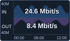

# Compact Interface Traffic

An installable **custom Grafana diagram panel** containing router representations, connections, and compact Cisco port/tunnel traffic displays.
Each display has its own router/interface selection and can be positioned and resized next to a router representation.

**Target:** Grafana **13.2.2**. **Status:** requirements, design, and runnable mock metrics; no traffic visualization plugin yet.
**Repository:** [urrizzz/grafana](https://github.com/urrizzz/grafana). Documentation and accepted mockups are maintained in this repository.

**Accepted design reference:** [interactive wireframe](docs/assets/scalable-wireframe.html).
See [reference files and implementation guidance](docs/design-reference.md); the wireframe and screenshots are tracked in Git.

## Confirmed behavior

- Prometheus collects every **60 seconds** and forwards metrics to VictoriaMetrics.
- Grafana uses the **VictoriaMetrics data source plugin**.
- Each diagram traffic display selects `instance` and `ifName`, using fixed values or dashboard variables.
- Put `ifName`, `ifAlias`, `ifDescr`, status and capacity in an information block to the right of the graph. Router fields stay hidden by default.
- Source metric/label mappings and individual identity-field visibility are configurable.
- Capacity comes from `ifHighSpeed`, expressed in Mbit/s at the source.
- Clearly visible blue bars rise above the middle; purple bars extend below it. Current values use matching direction colors with readable contrast.
- Bars represent five-minute average bit rates, using one symmetric scale based on visible traffic.
- Text overlays the graph. Central IN/OUT values are five-minute averages at the dashboard range end.
- Follow dashboard time range and refresh; typical history is 12-24 hours.
- Traffic graph border matches the range-end status: green UP, red DOWN, gray UNKNOWN.
- Right-hand status circle and label: green UP, red DOWN, gray UNKNOWN (including stale status).
- Red middle-line segments mark historical DOWN intervals only, including past outages after recovery. Current DOWN retains history and shows central dashes.
- UNKNOWN retains history and shows dashes for central values.
- Keep current information visible; hovering the graph adds a vertical cursor and time-specific IN/OUT rates.
- Design the traffic area at **120 x 70 pixels**, with readable IN/OUT values; scale it proportionally upward.
- Keep channel details outside that traffic area; the right-hand block takes additional space.
- Configure through normal settings; dashboard authors do not write or paste scripts.

## Documentation

| Document | Purpose |
| --- | --- |
| [Accepted design reference](docs/design-reference.md) | Approved visual baseline, tracked assets, and superseded explorations |
| [Product specification](docs/product-spec.md) | Confirmed configuration, layout, and state behavior |
| [Metrics contract](docs/metrics-contract.md) | Source mappings, rates, capacity, and proposed quality rules |
| [Architecture](docs/architecture.md) | Custom diagram editor, persistence, and query boundaries |
| [Acceptance criteria](docs/acceptance-criteria.md) | Conditions the eventual implementation must satisfy |
| [Development plan](docs/development.md) | Implementation sequence and local environment constraints |
| [Decisions](docs/decisions.md) | Confirmed answers, proposed defaults, and remaining technical checks |

## Community alternatives

See the [research and local preview](docs/community-research.md) for similar plugins and the Canvas placement limitation.

## Mock metrics

A [local IF-MIB exporter and history generator](docs/mock-metrics.md) provides ten synthetic channels,
including normal traffic, DOWN, UNKNOWN, missing samples, and counter resets.

## Agreed implementation approach

Add one custom diagram panel to the dashboard, add routers and select their instances, then add the
interfaces to display. Freely position routers and traffic elements, resize plots, and configure connections
inside the panel. Save the diagram with the Grafana dashboard; turn editing off for normal viewing.
Grafana 13.2.2 remains unmodified. This supersedes the original built-in Canvas placement requirement.

The [diagram mockup](docs/assets/diagram-panel-mockup.html) is the accepted layout/editor reference;
the existing [traffic wireframe](docs/assets/scalable-wireframe.html) remains the component reference.
See [diagram workflow](docs/diagram-panel-concept.md) and [architecture](docs/architecture.md).
The [Canvas investigation](docs/implementation-investigation.md) explains why this route was selected.

Representative exported series/labels and the installed VictoriaMetrics plugin version remain to be inspected.
No software license has been selected. The visualization is not implemented. Implementation and backend compatibility validation remain pending.
