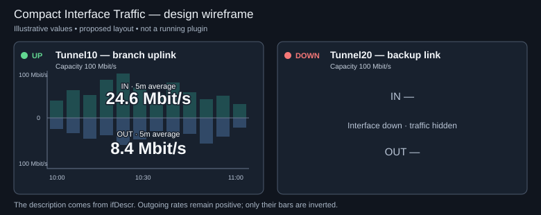

# Compact Interface Traffic

A Grafana panel for a compact traffic report on one Cisco router port or tunnel.
Select a router by `instance` and an interface by `ifName`; see its description,
operational status, bandwidth capacity, and mirrored incoming/outgoing traffic in one small panel.

**Status:** project specification and design. The traffic plugin is not implemented yet.
**Target:** Grafana **13.2.2**. **Repository:** [urrizzz/grafana](https://github.com/urrizzz/grafana).

The wireframe uses fictional data. Bars sit behind the text. Incoming traffic rises above the
center line; outgoing traffic extends below it. Current five-minute rates are centered in their respective halves.

## Required behavior

- Select exactly one router (`instance`) and one port/tunnel (`ifName`).
- Display `ifDescr`, an UP/DOWN label with a green/red circle, and interface bandwidth capacity.
- When UP, show incoming and outgoing traffic as five-minute bars in the panel background.
- Keep all text above the bars, including the current IN and OUT five-minute rates.
- Show a small number of time labels along the bottom and an automatically scaled Y axis.
- Format rates and capacity using decimal bit units: bit/s, kbit/s, Mbit/s, Gbit/s.
- Keep missing or stale data distinguishable from a confirmed DOWN state and from zero traffic.

## Documentation

| Document | Purpose |
| --- | --- |
| [Product specification](docs/product-spec.md) | Layout, configuration, display rules, and state behavior |
| [Metrics contract](docs/metrics-contract.md) | IF-MIB mapping, rate calculation, queries, and data quality |
| [Architecture](docs/architecture.md) | Proposed query integration, rendering, and component boundaries |
| [Acceptance criteria](docs/acceptance-criteria.md) | Observable conditions for accepting the implementation |
| [Development plan](docs/development.md) | Environment, repository structure, and implementation milestones |
| [Decisions and open questions](docs/decisions.md) | Confirmed requirements versus proposed defaults |

## Assumptions to confirm before coding

The first draft assumes a Prometheus-compatible Grafana data source fed by `snmp_exporter`,
and **average bit rate over five minutes**, rather than peak traffic. IF-MIB specifies the
router objects; it does not determine the storage system, exported metric names, or labels.
The query examples must be checked against real metric samples.

“Bandwidth” has two meanings here: **capacity** in the header and **observed traffic rate**
in each half of the chart. Tunnel capacity may need a configured override when the device's
reported value does not describe the intended service capacity.

## Current repository scope

This initial revision contains documentation, a static wireframe, and repository settings.
It does not include a runnable plugin, live-router connection, or deployment automation.
No software license has been selected yet; a public repository alone does not establish one.
