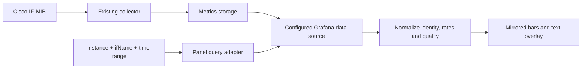

# Proposed architecture

## Plugin and compatibility

Build a **panel plugin** for Grafana 13.2.2 using TypeScript and React 19, with matching Grafana SDK packages.
Proposed display name: **Compact Interface Traffic**.
Provisional plugin ID: `urrizzz-compacttraffic-panel`; confirm this before implementation/signing.
The GitHub repository name can remain `grafana` regardless of the plugin ID.

Grafana distinguishes visualization panels from data-source plugins; see
[plugin types](https://grafana.com/developers/plugin-tools/key-concepts/plugin-types-usage).
This project consumes existing collected data. It does not introduce a new SNMP collector or require a Go backend for the MVP.

## Data flow

The storage/data-source type is still to be confirmed. The first adapter is proposed for Prometheus.

## Query ownership: proposed decision

The requested user experience is to change `instance` and `ifName` in panel options and have the whole report update.
Ordinary panel option values are not automatically substituted into arbitrary queries in Grafana's query editor.
Therefore the proposal is a **panel-managed query adapter** using an existing selected Grafana data-source UID.
It generates the required queries and calls the configured data source through Grafana's supported runtime APIs.

Before implementation proceeds, validate the Grafana 13.2.2 data-source query API and subscription lifecycle in a small integration spike.
The adapter must:

- Resolve single-valued dashboard variables and the current panel time range.
- React to refresh, time-range, variable, identity, and data-source changes.
- Use the data source's authentication/proxy path; never query router IPs or arbitrary metric-server URLs directly.
- Cancel/unsubscribe when inputs change or the panel unmounts. Ignore late responses from previous selections.
- Keep metadata/current queries distinct from fixed-step historical queries; request enough data points for 300-second resolution.
- Normalize Grafana data frames and their source timestamps into the contract in [metrics-contract.md](metrics-contract.md).
- Return clear errors and avoid multiple active refresh loops or duplicated panel-editor queries.

If this integration cannot satisfy Grafana's lifecycle reliably, the alternative is native panel queries with dashboard
variables plus a provisioned dashboard. That alternative changes where the parameters live and must be documented
and agreed before replacing the requested two-option workflow.

Variable interpolation guidance: [Grafana variable support](https://grafana.com/developers/plugin-tools/how-to-guides/data-source-plugins/add-support-for-variables).

## Proposed module boundaries

| Module | Responsibility |
| --- | --- |
| `options` | Instance, ifName, data source, validation, and optional capacity override |
| `query` | Backend-specific selectors, query execution, time alignment, and cancellation |
| `data` | Unique-interface resolution, source timestamps, rate quality, status and capacity normalization |
| `format` | Decimal bit-rate units, significant digits, timestamps, and accessible labels |
| `chart` | Shared symmetric axis, five-minute rectangles, gaps, and responsive tick layout |
| `components` | Header, state display, foreground IN/OUT values, and tooltips |

Keep rate conversion, bucket alignment, and status mapping as pure functions so they can be tested with fixed inputs.
Use synthetic fixtures rather than live routers for routine tests.

## Rendering approach

Proposed MVP: one SVG plot with bars and axes, plus foreground text positioned above it.
SVG suits a small chart, scales with panel dimensions, and is easy to inspect in browser tests.
At the proposed seven-day maximum, evaluate performance with 4,032 bars; move to canvas if measurements require it.
Rendering technology may change without changing the display contract.

Use positive values in the data model and a sign inversion only for OUT coordinates.
Choose the scale once for both halves. Use text content rather than HTML injection for interface descriptions.
Make the foreground readable in both themes and prevent decorative layers from blocking useful hover targets.

## Delivery boundaries

The repository currently contains design documents only. No runtime dependency manifest or implementation has been added.
Scaffolding, fixtures, tests, a development server definition, and CI will be introduced in the implementation phase.
Signing/publishing will require the final plugin identity and the owner's Grafana account; GitHub ownership alone does not establish a signing namespace.
