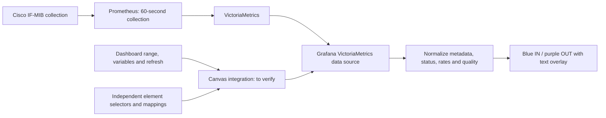

# Architecture and Canvas feasibility

## Required host

The user explicitly requires multiple independently configured, movable, resizable traffic displays
**inside Grafana's built-in Canvas panel**, running Grafana **13.2.2**.
A standalone panel on the dashboard is not an agreed substitute.
The earlier standalone panel-plugin architecture is superseded by this requirement.

## Extension feasibility: unresolved

The [Canvas documentation](https://grafana.com/docs/grafana/latest/visualizations/panels-visualizations/visualizations/canvas/)
describes built-in element types, placement, and data bindings. It does not establish an external plugin API
for registering a new time-series Canvas element. The
[upstream Canvas registry](https://github.com/grafana/grafana/blob/main/public/app/features/canvas/registry.ts)
examined during this review imports internal element implementations and initializes their registry.

**Inference:** ordinary panel-plugin scaffolding is not sufficient proof of Canvas-element support.
These sources describe current documentation/main; the exact 13.2.2 implementation has not been verified.
The attempted version-pinned source fetch was unavailable, which is not evidence that the version lacks the capability.

Before scaffolding:

1. Inspect the exact installed 13.2.2 Canvas implementation and supported extension APIs.
2. Prove a minimal custom element can be registered, rendered, resized, saved, and reloaded in the built-in Canvas.
3. Prove access to time-series frames and per-element configuration, dashboard variables, range, and refresh.
4. Determine whether the route is supported without modifying Grafana core.
5. If only a core patch/fork or replacement panel can satisfy the visuals, document the concrete tradeoffs and
   obtain a delivery decision. Such changes are not authorized by the current documentation task.

Do not label an ordinary dashboard panel, static SVG image, or replacement Canvas plugin as satisfying the built-in Canvas requirement.
The traffic renderer can be designed independently while the host integration is investigated.

## Data flow and query ownership

Use the existing data source's Grafana query/authentication path. Do not query routers or collect SNMP in this project.
The feasibility spike must decide whether Canvas-owned queries can supply separately keyed frames or whether a supported
host adapter can generate them per element. Per-element settings do not automatically become data-source query variables.
The user should not have to manually synchronize several query expressions after selecting another channel.

Use configured source mappings, resolve fixed values/dashboard variables, and preserve exactly one channel per element.
Deduplicate identical requests where useful, cancel obsolete subscriptions, and ignore late responses for old selections.
Keep history requests (300-second resolution), range-end current rates, and metadata/status logically distinct.
Use dashboard refresh events, not a second polling clock. Preserve valid history on DOWN/UNKNOWN transitions.
Data from one element must never leak into another. Verify reload/duplication preserves independent settings.

## Rendering and configuration requirements

Implement proportional scaling within the component, including traffic typography, margins, axes, bars,
and overlays. Do not leave labels or padding at fixed screen-pixel sizes while only the plot shrinks.
Keep the visual hierarchy, text alignment, and shared IN/OUT geometry consistent at different sizes.

A proposed implementation is a shared logical coordinate system with a uniform scale derived from available
width and height, using SVG viewBox behavior or equivalent transforms. This is an engineering option, not a
confirmed rendering technology or aspect ratio. Validate arbitrary element proportions without stretching
text. Long metadata needs an explicit fitting policy; shrinking alone must not hide enabled fields.

Package layout, querying, and scaling behavior behind ordinary component settings. Users select the data
source, router/interface, mappings, and visible fields without editing chart functions or rendering scripts.
The Business Charts research preview remains a separate scripted comparison, not the intended configuration UX.

## Proposed implementation boundaries

| Area | Responsibility |
| --- | --- |
| Host integration | Canvas element registration, editing, persistence, resize, dashboard lifecycle |
| Options | Selectors, mappings, visibility, data-source reference and validation |
| Queries | VictoriaMetrics plugin requests, interpolation, fixed-step history, cancellation |
| Normalization | Unique identity, metadata, rates, capacity, source freshness and errors |
| Rendering | Mirrored bars, shared scale, text overlay, state circle and DOWN middle line |
| Formatting | Decimal bit units and directly visible time/quality information |

TypeScript with React and matching Grafana packages is a candidate after the host API is established.
The provisional display name is Compact Interface Traffic. Packaging, plugin ID, signing, and code layout depend on
that decision; the old provisional standalone panel ID is not an accepted Canvas delivery model.

Use SVG or another supported rendering primitive with blue/purple bars and foreground text. The wireframe is a static
specification illustration, not an embeddable runtime implementation. No tooltips are required.
Benchmark multiple elements at 12-24 hours (up to 576 bars per element at 24 hours) and longer user-selected ranges.
A seven-day hard limit and a fixed minimum size are not confirmed requirements.

## Revised compact layout

The primary traffic area is 120 x 70 CSS pixels. Design readable IN/OUT values at that native size
and scale upward proportionally. Put identity fields, status and capacity in a separate block to its right,
with readable independent typography. The block consumes additional space. This supersedes whole-card
downscaling and metadata/status/capacity overlays inside the graph. Keep the blocks bound to the same
interface; validate placement and lifecycle together in the eventual Canvas integration.
